# Slide Code

Slide Code 是一种由 Minepig 创造的新的 Slide 语法，一条复杂的 Slide 路径可以通过一串字符来表示，例如：`5Q9A1P98CQ49K5`。最早的 Slide Code 展示视频是 [相信彩虹，但是舞萌DX2077](https://www.bilibili.com/video/BV1Uu42eqEWF/)。MajdataViewX 自 6.1.0 版本开始已经支持 Slide Code 的编写。

使用 Slide Code 你可以画出如下的这些传统语法写不出来的 Slide：

反向 ppqq-Slide：

更大的心形 Slide：

单手比心：

很像 `1v4` 但不是 `1v4` 的弧线 Slide：

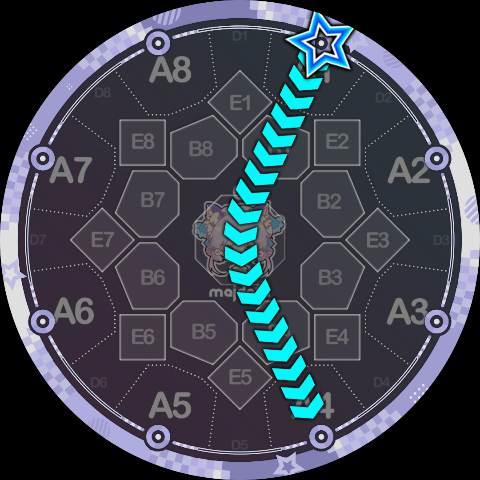

很像 `1p5` 但不是 `1p5` 的折线 Slide：

更新但不一定更热的字母押：

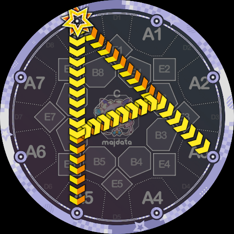

阴阳鱼：

其他的一些不可名状的东西：

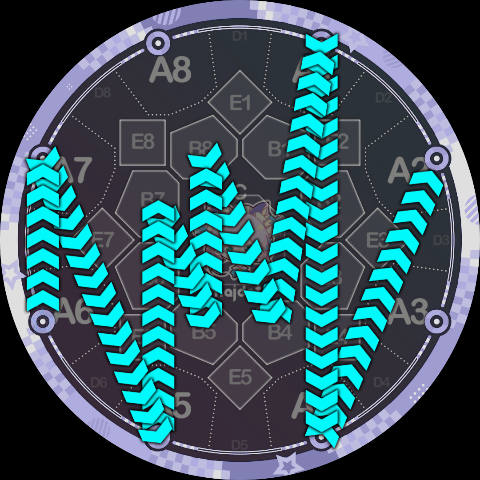

## 1. 基本语法

Slide Code 的设计理念基本上是：把官方的 Slide 形状切成一小段一小段的片段，然后在拼接成新的 Slide 路径。对 Maimai 比较熟悉且注意力集中的玩家们应该可以注意到，**官方的 Slide 基本上可以看作直线和圆弧的固定组合**，Slide Code 就是在使用这些线段、切线、圆弧作为组合用的片段来拼接。

Slide Code 的语法仅包含下面两种字符：

* **指令**：大写字母 `A, B, C, K, P, Q`
* **参数**：数字 `0~9`

一条 Slide Code 可以被看成是一连串的 `(指令, 参数)` 二元组的缩写，它们组成序列，依次描述了一段段的路径片段。根据指令的具体含义，我们可以将它们分成两组：节点指令 `A, B, C, K`（前往某个特定点）；轨道指令 `P, Q`（在特定圆周上旋转）。

### 1.1. 节点指令

这类指令要求 Slide **走直线前往指定的判定区位**置，因此这类指令连带上后面的参数，其实就是目标判定区的名字，即 `A1, B3, C, B8` 这种。

熟悉 Maimai 的玩家们应该知道，官方的 Slide 判定是只看 A、B、C 区，不考虑 D、E 区的，因此，为了能够给 Slide Code 定义的 Slide 能够写出合理的判定队列，**Slide Code 中只包含了 A、B、C 区对应的指令**：

* **A 指令**：直线前往 A 区。参数为 `1~8`，表示具体 A 区的键位号。
  * 注意：目标点不在 Touch 的位置，而是位于**判定线上**，允许前往相邻位置。
* **B 指令**：直线前往 B 区。参数为 `1~8`，表示具体 B 区的键位号。
  * 注意：目标点不在 Touch 的位置，而是稍微偏向屏幕中心的位置（考虑 `1-4` 和 `2-5` 的交点，它并不在 `B3` 这个 Touch 的位置上）。
* **C 指令**：直线前往 C 区（屏幕正中心）。**此指令后不可跟随任何参数。**

具体而言，这 17 个节点的位置如下图：

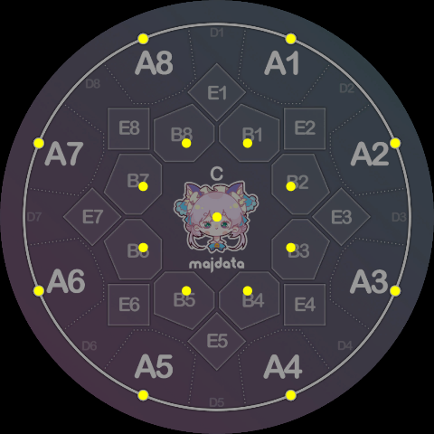

请注意它们与相应判定区的 Touch 位置的差异：

之所以引入以上的位置差异，是为了最大化的沿用官方 Slide 形状，这一定程度上可以让组合出来的 Slide 看起来更美观。

特别的，**由于官方 Slide 永远只会结束在 A 区**，Slide Code（目前）也保留了这一个性质，我们使用一个特殊的指令标识 Slide 的结束：

- **K 指令**：表示 Slide 的终点。其视觉表现与 A 指令完全相同，但它标志着整条 Slide 结算结束。**Slide Code 必须以 K 指令及其参数结尾。** 参数为 `1~8`，表示具体 A 区的键位号。

> K 指令之所以采用 K 这个字母，实际上是一个双关。一个直白的解释是“按键”（Key），由于外键在屏幕外面，Slide 前往某个外键相当于“离开了内屏”，因此就是结束了。
> 此外，众所可能不周知，Minepig 是乐理深度爱好者，因此 K 的第二个解释是字面意思的“终止”（Cadence，德文 Kadenz），neta 自乐理中的终止四六和弦 $\mathrm{K}^6_4$。

技术上，我们有时会把 Slide 的起点也单独算作一种节点指令，但这个指令不会真的出现在 Slide Code 字符串中：

- **X 指令**：表示 Slide 的起点，**但在 Slide Code 中必须省略字母 `X`，直接像传统 Slide 语法 `1-4` 一样单独写数字即可。** 参数为 `1~8`，对应判定线上的八个起始点，也即 A 指令的节点位置。

有了以上四个指令我们已经可以写出下面这些简单的折线 Slide 了：

`1B7K5`，即 1 号键出发，在 B7 转折，到 5 号键结束，看起来很像 `1p5`。

`1A3A5A7K1` 基本上就是 `1-3-5-7-1` 的 Slide Code 写法。

`8B7A6B5A4B3A2B1K8` 是一颗四芒星。

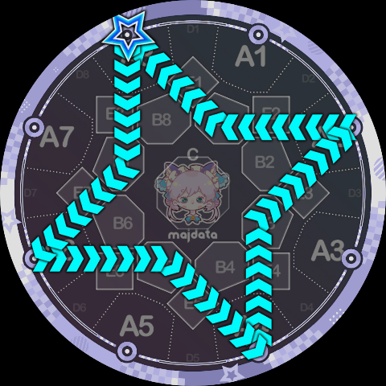

`8B6CB3K1`，看起来像一个小型的 W。

### 1.2. 轨道指令

这类指令要求 Slide **绕着特定的圆形轨道旋转**，如果路径起点在该圆形外部，会先沿着切线切入圆周再旋转，离开轨道去往外部时，也会先旋转到合适角度再沿着切线离开。

在官方的 Slide 形状中，共有 10 个不同的圆，在 Slide Code 中它们各自被赋予了一个 `0~9` 的编号：

* 侧边圆：标准语法中 ppqq-Slide 绕行的圆，总共有 8 个。方便起见，侧边圆的编号与它经过的 D 区键位号一致，取值范围是 `1~8`。（例如标准语法的 `1pp4` 绕行的圆经过了 D3，就是 3 号圆）
* 中央圆：即标准语法中 pq-Slide 绕行的圆，它不经过任何的 D 区，所以被赋予了编号 `0`。
* 最外圆：即标准语法中 `<`, `>` Slide 绕行的圆，也即判定线本身，它经过了所有的 D 区，所以被赋予了最大的编号 `9` （也只剩这一个编号了）。

如图所示是中央圆的具体定义：

这是侧边圆的定义（图中为 3 号圆）：

最外圆就是判定线本身，不再赘述。

旋转可以是顺时针或者逆时针，Slide Code 化用了标准 simai 的 `p, q` 记法，构造了如下两个轨道指令：

* **P 指令**：绕指定圆**逆时针**旋转。参数为 `0~9`，表示具体圆的编号。
* **Q 指令**：绕指定圆**顺时针**旋转。参数为 `0~9`，表示具体圆的编号。

利用这两个轨道指令，我们可以把官方的 Slide 形状转译成 Slide Code：

`1pp6 = 1P3K6`，即 1 号键出发，绕 3 号圆逆时针旋转，然后到 6 号键结束。

`1q4 = 1Q0K4`，这里是恰好转了 360°。

`1>1 = 1Q9K1`，同样是恰好转了 360°。

注意，官方的 `1pp4` 和 `1pp5` 比较特殊，因为它们绕行的圆心角超过了 360°，这种情况下，Slide Code 需要将轨道指令重复一遍，来表示”多绕一圈“：

`1pp4 = 1P3P3K4`，重复的 `P3` 表示要多绕 3 号圆一圈。

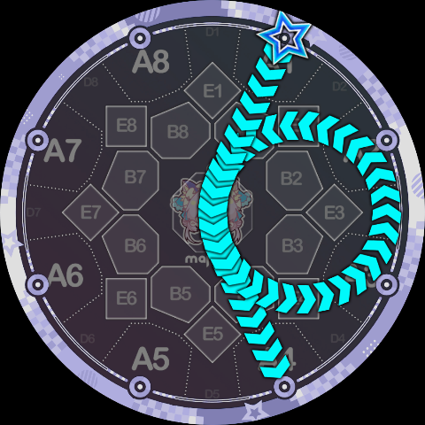

`1pp5 = 1P3P3K5`，如果回看一下侧边圆的形状定义，应该可以理解为什么这里超过了 360°，而不是恰好 360°。

当然，这意味着你可以故意不多绕一圈，比如：

很像 `1-5` 但不是 `1-5` 的 `1P3K5`（注意轨迹稍微向左弯曲了一点）。

很像 `1v4` 但不是 `1v4` 的 `1P3K4`。

既然可以要求多绕一圈，那当然也可以多绕很多很多圈，比如 `1P0P0P0P0P0K8` 总共绕了 4.75 圈：

### 1.3. 省略规则

为了方便编写，Slide Code **允许省略连续相同的指令字母**。解析器在读取时，凡是遇到数字参数前没有出现英文字母指令的情况，就一路向前查找，使用最近出现的一个指令。

**示例 1：**

* **完整**：`5Q9A1P9P8CQ4Q9K5`
* **简写**：`5Q9A1P98CQ49K5`
* **解析结果**：`(X)5 - Q9 - A1 - P9 - P8 - C - Q4 - Q9 - K5`
* *解释：开头的 `5` 前面没有字母，技术上解释成起点指令 `X5`；`P98` 中的 `8` 前面没有字母，向前找到 `P`，解析为 `P9 - P8`，`Q49` 同理。*

**示例 2：**

* **完整**：`1P0P0P0P0P0K8`
* **简写**： `1P00000K8`
* **完整展开：** `(X)1 - P0 - P0 - P0 - P0 - P0 - K8`
* *解释：利用省略规则，在使用轨道指令需要多绕若干圈时，不需要反复写 `P, Q`。实际上这个省略规则就是为了这碟醋包的饺子。*

**示例 3：**

* **完整**：`1A3A5A7K1`
* **简写**： `1A357K1`
* **完整展开：** `(X)1 - A3 - A5 - A7 - K1`
* *解释：利用省略规则，可以快速写出在 A 区之间反复横跳的路径。*

### 1.4. 与 Simai 语的兼容

从上述例子其实可以注意到，一条完整的 Slide Code 字符串一定由数字开始，由数字结束。而标准 Simai 语的 Slide 语法也是数字开始，数字结束的。因此我们在写 Simai 谱面文件时只需将 Slide Code 掐头去尾以后的中间部分看作类似于 Simai 语中 `<, >, p, q, pp, qq` 等表示形状的字符串，然后按照 Simai 语的标准对 Slide 做各种修饰即可。例如可以写 `1bxA357K1b[2:1]`，就是一条路径是 `1A357K1`，星星头是 Break + Ex ，总时长是一个二分音符的 Break Slide，非常好理解。同头 Slide 也是一样用 `*` 代替起始键位。

甚至，虽然不知道这么做有什么意义，Slide Code 也可以和标准 Slide 语法拼成连锁 Slide，例如 `1bA357K1>1[1:1]` 就是把 `1A357K1` 和 `1>1` 拼起来了。

> 视觉上，一条完全用 Slide Code 描述的 Slide，和多条标准 Slide 和 Slide Code 拼接出来的连锁 Slide 有细微的差异，表现在轨迹上的箭头位置不一样。类似于标准 Simai 中，`1-3-5[4:1]*V35[4:1]` 尽管路径完全重合，但是后半段轨迹的箭头位置是不一样的。在某些极度注重视觉效果的情境下，可能会需要用到这个技巧。

## 2. Slide 路径解析

前面已经介绍了全部 6 种指令的定义，Slide Code 解析时，会首先展开成 `(指令, 参数)` 二元组的序列，每两个相邻的二元组就定义了一条 Slide 路径片段，所有的片段拼接起来就得到了完整的 Slide 路径。

理论上任何两个 `(指令, 参数)` 二元组之间可以任意地连接，不过考虑到具体语义，部分连接是不被允许的。接下来分成四类介绍指令连接时背后的语义。

### 2.1. 节点 → 节点 

这种连接是最好了解的，因为节点指令是“**直线前往指定点**”，因此当两个节点指令连接时，表示的路径片段就是一条连接两点的线段，任何两个节点指令都可以相连。先前介绍节点指令时已经见过不少例子了，在此不再赘述。

### 2.2. 节点 → 轨道

节点指令后面连接轨道指令时，基本的语义就是“**沿着切线切入轨道，然后停在切点上准备开始绕行**”，具体的绕行角度仅由轨道指令还不足以判断，需要看轨道指令后面接了什么，所以会在之后的部分介绍。

众所周知，点和圆的关系有三种：点在圆外、点在圆上、点在圆内，因此当节点指令后面连接了轨道指令时，也会出现这三种情况。

节点在轨道内的情况，例如 `B2P3` 这样的序列，**这种连接是被禁止的**，因为没有一个合理的连接路径。

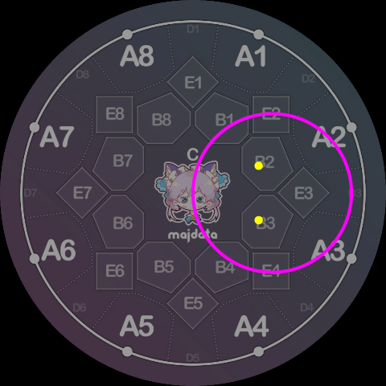

节点在轨道内的全部可能性有这些：

- 中央圆（编号 `0`）的内部有节点 C。
- 每个侧边圆（编号 `1~8`）的内部都有两个 B 区节点，例如轨道 3 内有 B2、B3。
- 所有的 B 区和 C 区节点都在最外圆（编号 `9`）内部，因此只有 A 区节点可以前往最外圆。

节点在轨道上的情况，例如 `CP3`、`A1Q9` 这样的序列，因为已经在轨道上所以就不需要走切线了，停留在原地准备开始绕行。全部的可能性有：

- 节点 C 在所有的侧边圆上。
- 所有 A 区节点都在最外圆上。

下面几种情况可能看起来有点像是“在轨道上”，但实际上是在轨道外，距离轨道圆周有一小段距离：

- 所有 B 区节点实际上都在中央圆外。
- 侧边圆经过的两个 A 区和两个 B 区，它们对应的节点实际上也在圆外。

节点在轨道外的情况，需要根据轨道指令的具体绕行方向，沿着对应方向的切线移动到切点的位置，如下图所示是 `A1P5` 的连接方式，非常好理解：

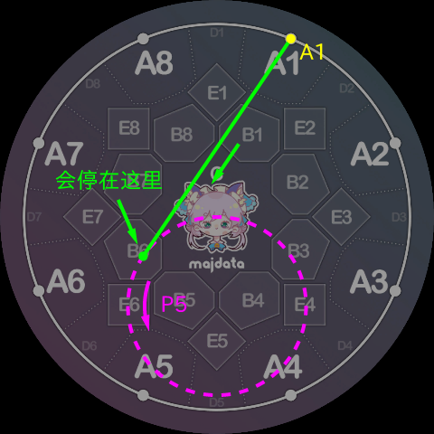

### 2.3. 轨道 → 节点

在来到轨道上以后，具体绕行多远，需要看后面连接了什么指令，对于轨道指令后面连接节点指令时，基本语义是“**绕行到新的切点，然后沿切线离开，前往指定点**”。与先前 节点 → 轨道 类似，也可以分成三种情况，**节点在轨道内的情况依旧被禁止**，在轨道上的情况也只需要绕行不需要走切线。

例如，顺着上文 `A1P5` 的例子，假如整个片段是 `A1P5A7`，那么 `P5A7` 的部分会像下图一样解析：

解析器在计算绕行角度时，**会以尽可能短的路径绕行，任何情况下都不多绕一圈**，这也就是为什么在翻译官方的 `1pp4, 1pp5` 形状时需要显式指明多绕一圈。不过，对于绕行起点和终点恰好重合的情况（例如官方的 `8p5`），会绕完整的一圈 360°。总的来说在没有显式指明多绕圈时，**绕行角度永远在 `(0°, 360°]` 区间内**（有一个例外，后面提）。

使用以上三种连接方式已经足够分析很多的 Slide Code 了，例如上文的例子如果是完整的一条 Slide 就写作 `1P5K7`：

再比如本文开篇展示的反向 ppqq-Slide，只需要将正向 ppqq 翻译成 Slide Code 以后，倒着写一遍。例如下图就是 `5pp4/3qq4` 的反向，只需先翻译成 `5P7K4/3Q2K4`，然后逐一反转为 `4Q7K5/4P2K3`。当然，由于变成了同头 Slide，还需要按照同头 Slide 的语法最终改为 `4Q7K5 *P2K3`：

再比如下图是 `4Q2K4 *P7K4`：

下图是 `4P2B8P7K4`，利用 B8 区作为两个侧边圆的中转点：

下图是 `1Q2CP6K5`，利用 C 区作为中转点，由于两圆刚好在屏幕中心相切，看起来衔接非常顺滑：

### 2.4. 轨道 → 轨道

轨道指令接轨道指令的情况，**只允许相同旋转方向的连接**，即 P 指令只能连接 P 指令，Q 指令只能连接 Q 指令。P、Q 指令之间如果要连接必须插入一个节点指令作为中介。

对于两个轨道相同的特例，例如 `P1P1`（或简记为 `P11`），先前已经介绍过，其含义是在这条轨道上绕完整的一圈，用于显式指明要绕多少圈。

两个轨道不同时，含义是做一次轨道转移，在 10 个轨道中任意两个之间，除了**中央圆和最外圆的互相转移不被允许**（也就是说例如 `P09, Q90` 这种是不允许的），其余都可以发生轨道转移。

**在中央圆和 8 个侧边圆之间**（即轨道 0 ~ 8 之间），**轨道转移通过一条外公切线完成**，两个圆的外公切线有两条，解析器会自动根据当前绕行方向选择正确的那一条。这里直接用例子来展示，下图的轨迹记作 `4Q37K5`，其中包含了 3 号圆到 7 号圆的轨道转移，是一条外公切线：

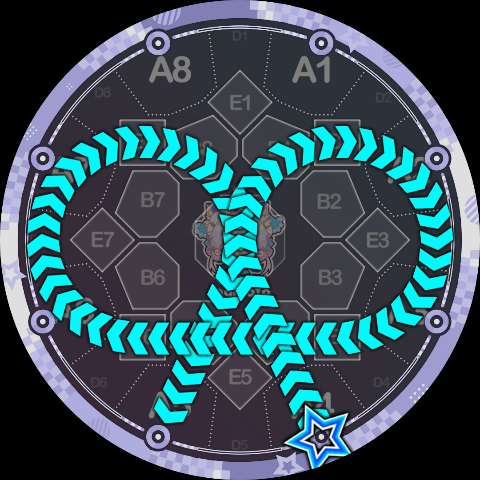

可以对比一下，如果“想当然地”用经过的两个 B 区，也就是 B4、B5 作为中转节点，写出来的 `4Q3B45Q7K5` 是这样的，可以看到中间出现了折点，两者外观并不相同：

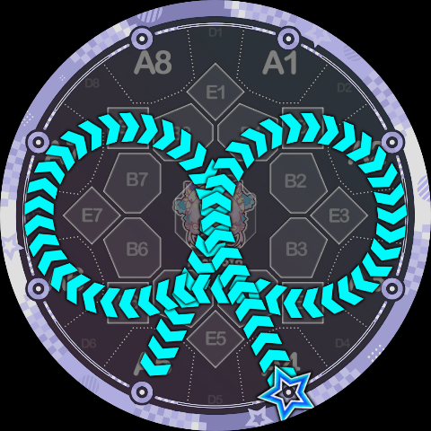

再看一个用到了中央圆的例子，`6Q0380K4`，看起来有点像三叶结：

然后是侧边圆和最外圆之间的转移（即轨道 1 ~ 8 和轨道 9 之间），由于**侧边圆实际和最外圆是内含关系，没有公切线，所以选取了一个特定的共切圆作为转移路径**。依旧直接看例子，这是 `8Q79K3`，外观上有点像 `8qq7>3` 但衔接更丝滑：

我们可以更具体地标明每一段路径：

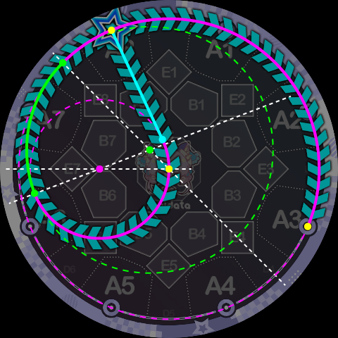

上图中，绿色圆弧就是 `Q79` 的轨道转移部分，它是绿色虚线圆的一部分，这是最外圆和 7 号侧边圆的公切圆。这个公切圆与最外圆的切点恰好是 D8 区的中心，因此，还可以用从最外圆到 1 号侧边圆的第二次轨道转移，补全这个公切圆的另外一部分。如下图所示，这是 `1Q892K8`，其中 A7 A8 A1 A2 这一段实际上是连续的圆弧：

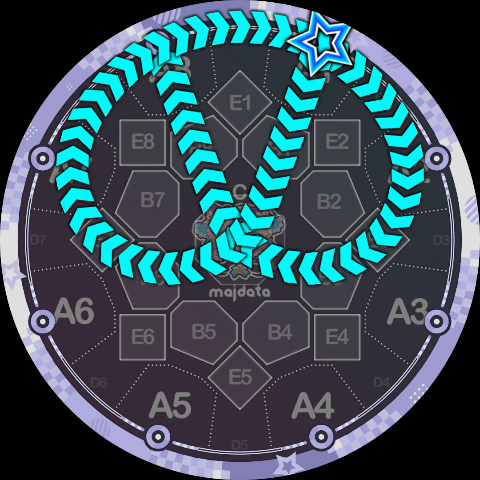

也许有人会注意到，在上图的 `1Q892K8` 中，`Q9` 指令的绕行角度实际上是 0°，因为 `Q89` 的转移终点和 `Q92` 的转移起点实际上是同一个切点。事实上这是 Slide Code 解析器专门留的特殊情况，因为这个转移的公切圆半径足够大，上图中 A8 ~ A1 的圆弧视觉上已经几乎就是在判定线上了，于是就允许这种情况下取到 0° 的绕行角度。

现在我们已经足够分析出下图的阴阳鱼 Slide 写成 Slide Code 的样子了，是 `5P98CQ49K1`

## 3. 判定队列解析

为了让使用了 Slide Code 的谱面可以上机游玩，有必要为 Slide Code 拟一套判定队列。幸运的是，由于 Slide Code 从一开始设计时就基本遵循“官方 Slide 切片拼接”的理念，其判定队列也可以较为容易地通过拼接得到。

以上图中的阴阳鱼 Slide 为例，可以很自然地写出其判定队列是：`A5, A4, A3, A2, A1, A8, A7, B6, C, B2, A3, A4, A5, A6, A7, A8, A1`。

再如下图中的 `1P5K7`，显然可以用 `3pp7` 和 `6qq1` 的判定队列做拼接，得到 `A1 B1/B8, B7/C, B6, A5, A4, B3, C, B7, A7`：

不过，Slide Code 中依然存在一些官方没有的形状，例如下图中 `1B46K1` 的三角形 Slide 的三条线段，其中 A1 到 B4，以及 B6 到 A1 两条线段可以从形如 `1pp6` 的 ppqq-Slide 尾段判定队列提取，而 B4 到 B6 则是全新的。这条 Slide 的判定队列最后被敲定为 `A1, B1/B2, B3/C, B4, B5/C, B6, B7/C, B1/B8, A1`：

也就是说，相隔一个键位的 B 区之间的连线，中间夹了一个 B 区和 C 区组成的 OR 判定区。类似的，还有下面这条 `6Q0380K4` 的判定队列是 `A6, B7, B8, B1, A2, A3, B4, B5/C, B6, A7, A8, B1, B2, B3, A4`：

此外还有下面这种相隔两个键位的 B 区连线，中间夹了两个 OR 判定区。这条 `8B63K1` 的判定队列是 `A8, B7, B6, B5/C, B4/C, B3, B2, A1`：

侧边圆的转移路径中也有类似的，相隔两个键位的 B 区连线，例如下图 `4Q53175K5` 的判定队列是 `A4, A5, B6, B7/C, B8/C, B1, A2, A3, B4, B5/C, B6/C, B7, A8, A1, B2, B3/C, B4/C, B5, A6, A7, B8, B1/C, B2/C, B3, A4, A5`:

## 4. 使用建议与样例

相信各位认真读到这里的谱师们一定能感受到 Slide Code 带来的极大自由度，事实上，正因为 Slide Code 自由度太大，因此并不是一个很容易驾驭的语法，随意地使用通常只会显得突兀、难看，而且不好玩。下面从观赏、游玩这两个方面谈一谈 Slide Code 的一些使用建议。

### 4.1. 外观上的建议

Slide Code 若想要更好地融入一张以官方 Slide 为主的谱面，首要的一件事情就是让自己也“看起来像是官方的 Slide”。下面是一些（Minepig 认为）可能还不错的例子，首先来看折线 Slide 的例子：

- `8B7K6[8:1]/1B3K5[8:1]`，这里 `1B3K5` 也可以换成标准语法的 `1q5`，利用的是标准 Slide 中的 `1-4/8-5` 即视感。

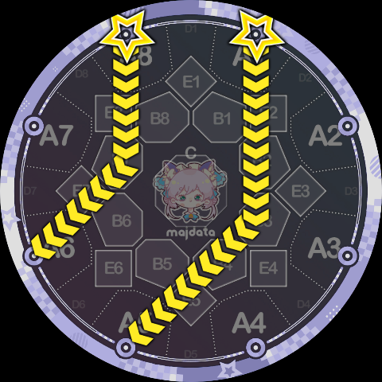

- `5B7K3[4:1]*-8-2[4:1]`，某种“F”字母押，这里官方的 `5-8-2` 的存在会让 `5B7K3` 看起来合理很多。

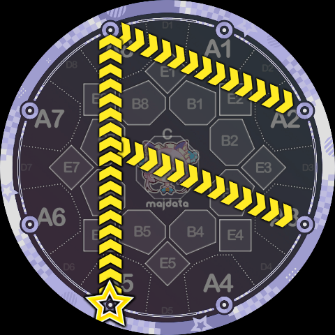

- `7-3[8:1]/1B3K5[8:1]`，看起来像……飞机？这里是用了一条 `7-3` 遮盖掉 `1B3K5` 的 B3 转折点，这种不在 C 区的莫名其妙的折点通常都是让 Slide 变丑的原因之一，所以盖住以后观感会好很多（而且看起来构图也更匀称一点）。

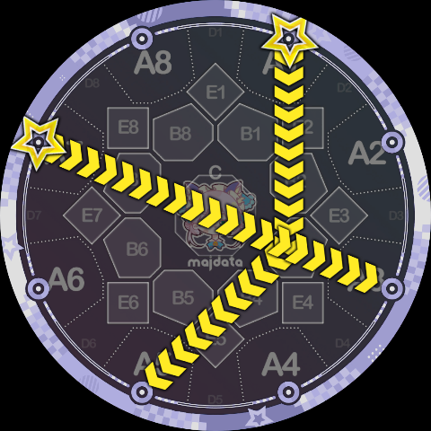

然后是用到了轨道指令的曲线 Slide，曲线 Slide 若想要“拟态”成官方 Slide，最简单的方法就是只用一个轨道，用类似 `1P4K7` 这样的“`PK/QK`”定式画一个像是 ppqq-Slide 的东西。我们知道官方的 ppqq-Slide 一开始都是先往 C 区走然后再开始绕圈，绕圈后离开的线段通常会比绕圈前进入的线段略长一些，所以 Slide Code 也可以尽量往这个方向靠拢，来看几个例子：

- `1P4K7[4:1]`，是不是看起来很像那么回事？实际上这不是任何一条 ppqq-Slide 的反向，单纯只是看起来像 `1pp7` 而已，但真正的 `1pp7` 是绕 3 号圆转的，这里是 4 号圆。

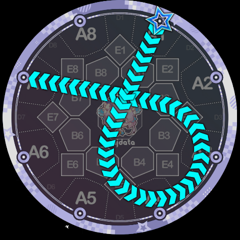

- 像这个 `1P5K8[4:1]` 看起来就稍微不那么有即视感，因为进入 5 号圆的切线离 C 区稍微有点距离，不过这个路径是对称的，这一点也可以增加美观度。

- 像下面 `1P2K8` 这种，就相对不那么好看了，虽说有点像官方的 `1pp8`，但很明显重心偏向一侧，看起来“歪了”。不过也有办法救，请看下面一个技巧。

一种提升美观度的方法是利用双押 Slide，画一个轴对称或者中心对称的形状，就像官谱里会有 `1pp3[4:1]/5pp4[4:1]` 这种配置。这样即使单个 Slide 画出来显得有些“偏颇”，一对 Slide 的观感则会好很多，来看下面的例子：

- `1P2K8[4:1]/5P6K4b[4:1]`，不知道读者怎么看，但作者自己感觉这个配置比前面那只有 `1P2K8` 的配置顺眼得多。

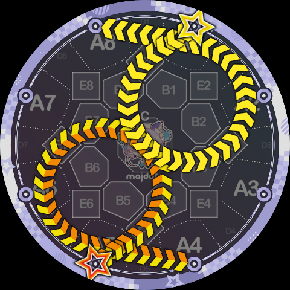

- 再比如下面这个 `1Q4K7[4:1]/5Q8K3[4:1]`，单独一条看起来并不好看，而且和官方 Slide 的差异也很大，但组成一个中心对称的配置以后其实还可以。

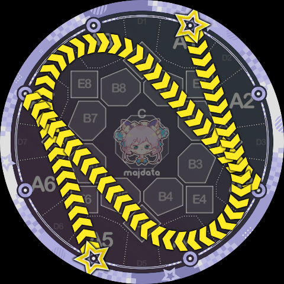

- 再来个轴对称的例子，下面是 `6P6K8[4:1]/3Q4K1[4:1]`，用法上和官方的 `3V58/6V41` 差不多。

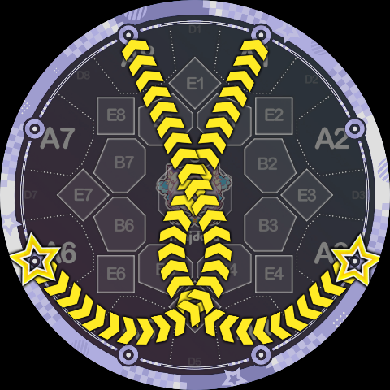

对于使用了多个轨道的 Slide，想要“拟态”成官方 Slide 基本不太可能了，因此这些 Slide 的绘制需要看谱师的个人审美及美术能力。通常还是遵循对称等形式美的规则，或是利用各种文字押、图形押，来使 Slide 画出来不突兀。下面给出一些例子：

- 前文已经多次提到的阴阳鱼 Slide，`5P98CQ49K1`，这里不再放图了。
- 小写 f 的字母押，`1P2CQ6K5[8:1]/6-2[8:1]`，这个图形的灵感来自于官谱オーバーライド（覆写）260 combo 处的“函数押”。有趣的是，把这个图形翻转一下还能得到一个小写 x 或者说希伯来字母 Aleph（א）的字母押。

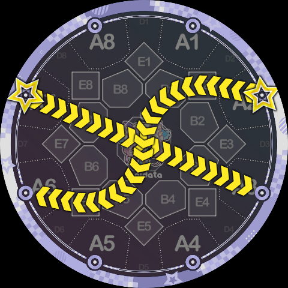

- `8Q87A6Q6K4[1:1]*P12A2P3K4[1:1]`，这个是……三叶草？反正挺有趣的一个图形。

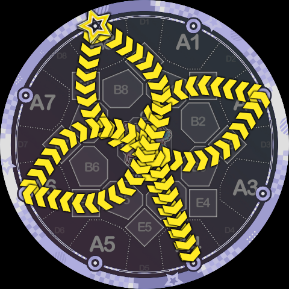

- `8P97B4Q0K1b[1:1]/4P93B8Q0K5[1:1]`，意味不明的双押 Slide，纯纯靠中心对称刷的美感，感觉有点像在搓螺旋丸？

**再看一些反面案例，下面的例子 Minepig 的观点是“看起来很丑”**：

- `1P15K4`（蓝）、`1Q8CP4K5`（绝赞）、`1P8K7`（黄），意义不明的弯曲，如果没有必须要用这种形状的理由，建议老老实实分别用官方的 `1-4`、`1-5`、`1^7` 或 `1-7` 平替。类似的还有比如 `1Q3K4` 建议用 `1^4` 平替、`1Q34K5` 建议用 `1>5` 平替。

- `1P43K5`，这种“胶囊形”的类 ppqq-Slide 美观度显著低于正常的 ppqq-Slide。单独一条看着非常突兀，如果要用的话建议考虑与其他图形组合一下。

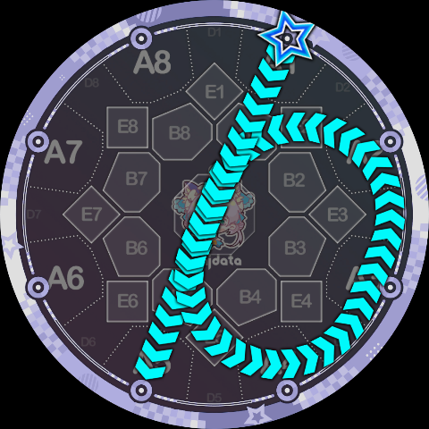

- `1P04K2`，不好描述的怪异感。这种形状和上面那个“胶囊”实际上属于同一类问题，就是在画转移轨道的时候没有把原来的圆轨道尽量勾勒出来，或者说构图上没有把握好，看着不像“两个圆弧 + 公切线”而是像“一条奇怪的曲线”。事实上这个例子只需要再加一条与之对称的 `5P08K6` 观感就会变好很多（万能的中心对称），其中一个原因就是两条 Slide 的轨迹共同把中央圆给描了出来。

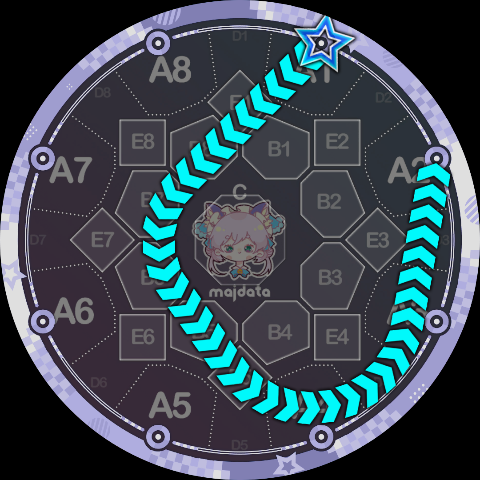

总而言之，用 Slide Code 画出好看的 Slide 是一个非常难的课题，且有很强的主观性。有时，难看的 Slide 反而能意外地表现出一些贴歌的属性（疯癫、搞怪等等）。篇幅有限，无法涵盖到方方面面，需要各位谱师在实践中慢慢尝试。

### 4.2. 玩法上的建议

目前 MajdataPlay 已经加入了 Slide Code 的支持，意味着使用 Slide Code 的谱面真的可以上机游玩了。那么，就像是作传统自制谱一样，除非从一开始就是打算写观赏谱，否则在写配置时势必需要考虑具体的游玩体验。

首先讨论一下读谱障碍，因为 Slide Code 写出来的 Slide 一般都是玩家从未见过的形状，除非是像前面一段说的那样，有刻意去“拟态”官方的 Slide 形状，否则对于玩家而言会有比较严重的读谱障碍，说白了就是“看不懂”。

这方面其实就和以前使用 Festival 的连锁 Slide 很像，形状越复杂越“超前”的 Slide，越应该在前后没有其它干扰的情况下出现，并且给够“拆弹”的时间。因此，像上文所述的那些利用对称凹造型或是各种图形押的长 Slide，通常就比较适合放在那种可以写长 Slide 的休息段，比如流行歌可能是副歌后的桥段，电子音乐可能是一段 Drop 之后的 Break 段，诸如此类。而音符密度相对大的段落，则适合采用那些简单的、更像官方形状的 Slide Code（或者干脆就是不要用 Slide Code）。

这里需要特别提一下那些“绕同一个圆好多圈”的 Slide，比如下图 `1P00000K8`，这种 Slide 从玩家的角度看其实是很难读的，因为你很难直接看出要转几圈。所以这种形状就比较适合给慢速 Slide 用，一样是给玩家时间“拆弹”。

一般来说，绕同一个圆超过了一圈半左右的情况，就很难一眼判断出绕行圈数了（而且一圈半已经很长了，轨迹长的 Slide 本来就不适合写成快速的）。

然后就是老生常谈的内屏无理，这个属于是只要有 Slide 就得思考一下的事情，不过现在反正可以写完让 DJAuto 来检查，不多赘述。

其实本质上，玩法相关的问题，如果有条件的话直接打开 MajdataPlay 试玩一遍比什么建议都有用，没有条件至少对着电脑屏幕比划比划也能解决 80% 的问题。对于使用了 Slide Code 这种自由度极大的语法的谱面而言，更是如此（如果不是观赏谱的话）。

### 4.3. Slide Code 配置样例

虽然上文已经配了很多很多的样例图了，但 Slide Code 的可能性可以说是无穷无尽的。下面收录了一些各处搜集来的 Slide Code 配置形状，可供参考。

`8B7B3K4[8:1]*B1B5K4[8:1]`

`8P1CQ5K4[8:1]*Q8CP4K4[8:1]`

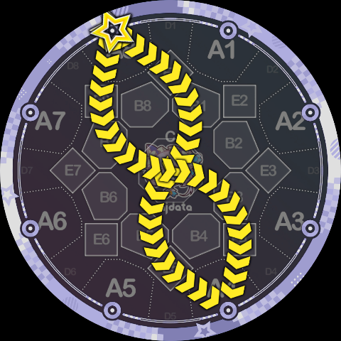

`8Q8CP4K4[8:1]/1P2CQ6K5[8:1]`

`6Q919K3b[1:1]`

`7Q7CP6K6[8:1]/2P3CQ4K3[8:1]`（……乌鸦坐飞机？）

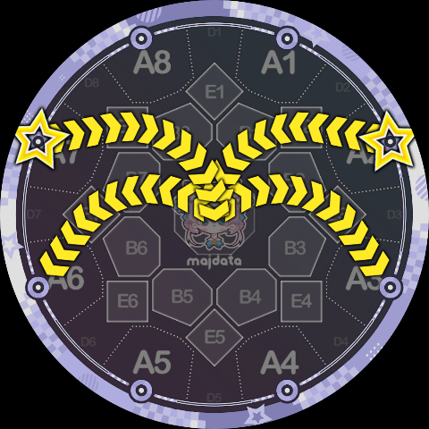

`7Q7CP6K6[1:1]/2P3CQ4K3[1:1]/8Q7CP5K5[1:1]/1P3CQ5K4[1:1]`（虽然多押了但这个蜘蛛真的酷吧）

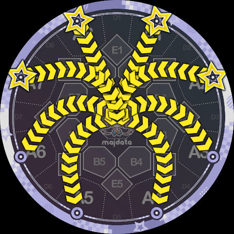

`1P13CQ75K5[1:2]`

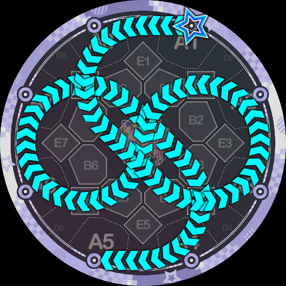

（样例部分未完待续……）

