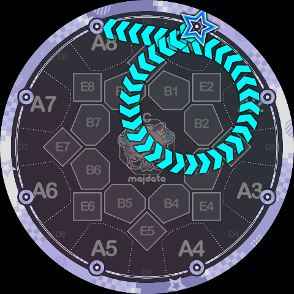
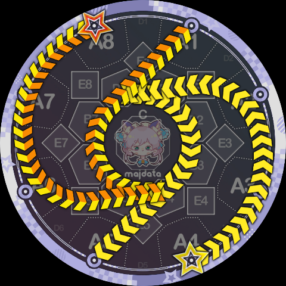
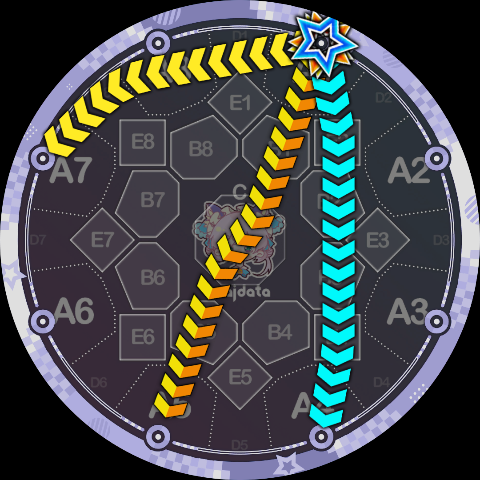

# 外观设计建议

相信各位认真读到这里的谱师们一定能感受到 Slide Code 带来的极大自由度，事实上，正因为 Slide Code 自由度太大，因此并不是一个很容易驾驭的语法，随意地使用通常只会显得突兀、难看，而且不好玩。下面从观赏、游玩这两个方面谈一谈 Slide Code 的一些使用建议。

Slide Code 若想要更好地融入一张以官方 Slide 为主的谱面，首要的一件事情就是让自己也“看起来像是官方的 Slide”。下面是一些（Minepig 认为）可能还不错的例子，首先来看折线 Slide 的例子：

- `8B7K6[8:1]/1B3K5[8:1]`，这里 `1B3K5` 也可以换成标准语法的 `1q5`，利用的是标准 Slide 中的 `1-4/8-5` 即视感。

- `5B7K3[4:1]*-8-2[4:1]`，某种“F”字母押，这里官方的 `5-8-2` 的存在会让 `5B7K3` 看起来合理很多。

- `7-3[8:1]/1B3K5[8:1]`，看起来像……飞机？这里是用了一条 `7-3` 遮盖掉 `1B3K5` 的 B3 转折点，这种不在 C 区的莫名其妙的折点通常都是让 Slide 变丑的原因之一，所以盖住以后观感会好很多（而且看起来构图也更匀称一点）。

然后是用到了轨道指令的曲线 Slide，曲线 Slide 若想要“拟态”成官方 Slide，最简单的方法就是只用一个轨道，用类似 `1P4K7` 这样的“`PK/QK`”定式画一个像是 ppqq-Slide 的东西。我们知道官方的 ppqq-Slide 一开始都是先往 C 区走然后再开始绕圈，绕圈后离开的线段通常会比绕圈前进入的线段略长一些，所以 Slide Code 也可以尽量往这个方向靠拢，来看几个例子：

- `1P4K7[4:1]`，是不是看起来很像那么回事？实际上这不是任何一条 ppqq-Slide 的反向，单纯只是看起来像 `1pp7` 而已，但真正的 `1pp7` 是绕 3 号圆转的，这里是 4 号圆。

- 像这个 `1P5K8[4:1]` 看起来就稍微不那么有即视感，因为进入 5 号圆的切线离 C 区稍微有点距离，不过这个路径是对称的，这一点也可以增加美观度。

- 像下面 `1P2K8` 这种，就相对不那么好看了，虽说有点像官方的 `1pp8`，但很明显重心偏向一侧，看起来“歪了”。不过也有办法救，请看下面一个技巧。

一种提升美观度的方法是利用双押 Slide，画一个轴对称或者中心对称的形状，就像官谱里会有 `1pp3[4:1]/5pp4[4:1]` 这种配置。这样即使单个 Slide 画出来显得有些“偏颇”，一对 Slide 的观感则会好很多，来看下面的例子：

- `1P2K8[4:1]/5P6K4b[4:1]`，不知道读者怎么看，但作者自己感觉这个配置比前面那只有 `1P2K8` 的配置顺眼得多。

- 再比如下面这个 `1Q4K7[4:1]/5Q8K3[4:1]`，单独一条看起来并不好看，而且和官方 Slide 的差异也很大，但组成一个中心对称的配置以后其实还可以。

- 再来个轴对称的例子，下面是 `6P6K8[4:1]/3Q4K1[4:1]`，用法上和官方的 `3V58/6V41` 差不多。

对于使用了多个轨道的 Slide，想要“拟态”成官方 Slide 基本不太可能了，因此这些 Slide 的绘制需要看谱师的个人审美及美术能力。通常还是遵循对称等形式美的规则，或是利用各种文字押、图形押，来使 Slide 画出来不突兀。下面给出一些例子：

- [轨道之间的连接](./track-transitions)中介绍的阴阳鱼 Slide，`5P98CQ49K1`，这里不再放图了。
- 小写 f 的字母押，`1P2CQ6K5[8:1]/6-2[8:1]`，这个图形的灵感来自于官谱オーバーライド（覆写）260 combo 处的“函数押”。有趣的是，把这个图形翻转一下还能得到一个小写 x 或者说希伯来字母 Aleph（א）的字母押。

- `8Q87A6Q6K4[1:1]*P12A2P3K4[1:1]`，这个是……三叶草？反正挺有趣的一个图形。

- `8P97B4Q0K1b[1:1]/4P93B8Q0K5[1:1]`，意味不明的双押 Slide，纯纯靠中心对称刷的美感，感觉有点像在搓螺旋丸？

**再看一些反面案例，下面的例子 Minepig 的观点是“看起来很丑”**：

- `1P15K4`（蓝）、`1Q8CP4K5`（绝赞）、`1P8K7`（黄），意义不明的弯曲，如果没有必须要用这种形状的理由，建议老老实实分别用官方的 `1-4`、`1-5`、`1^7` 或 `1-7` 平替。类似的还有比如 `1Q3K4` 建议用 `1^4` 平替、`1Q34K5` 建议用 `1>5` 平替。

- `1P43K5`，这种“胶囊形”的类 ppqq-Slide 美观度显著低于正常的 ppqq-Slide。单独一条看着非常突兀，如果要用的话建议考虑与其他图形组合一下。

- `1P04K2`，不好描述的怪异感。这种形状和上面那个“胶囊”实际上属于同一类问题，就是在画转移轨道的时候没有把原来的圆轨道尽量勾勒出来，或者说构图上没有把握好，看着不像“两个圆弧 + 公切线”而是像“一条奇怪的曲线”。事实上这个例子只需要再加一条与之对称的 `5P08K6` 观感就会变好很多（万能的中心对称），其中一个原因就是两条 Slide 的轨迹共同把中央圆给描了出来。

总而言之，用 Slide Code 画出好看的 Slide 是一个非常难的课题，且有很强的主观性。有时，难看的 Slide 反而能意外地表现出一些贴歌的属性（疯癫、搞怪等等）。篇幅有限，无法涵盖到方方面面，需要各位谱师在实践中慢慢尝试。
