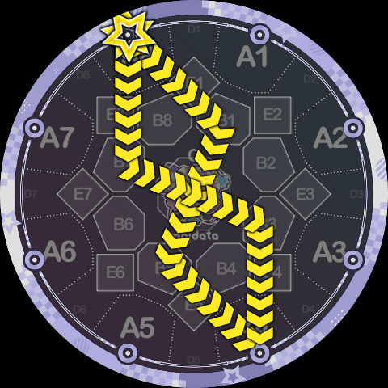
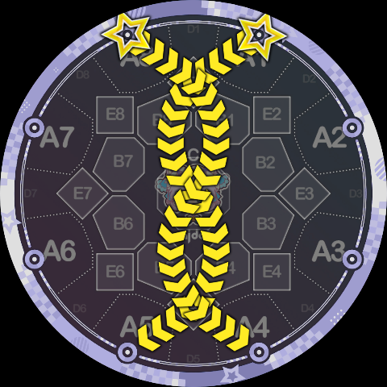
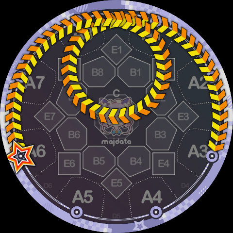

# 配置样例

虽然上文已经配了很多很多的样例图了，但 Slide Code 的可能性可以说是无穷无尽的。下面收录了一些各处搜集来的 Slide Code 配置形状，可供参考。

`8B7B3K4[8:1]*B1B5K4[8:1]`

`8P1CQ5K4[8:1]*Q8CP4K4[8:1]`

`8Q8CP4K4[8:1]/1P2CQ6K5[8:1]`

`6Q919K3b[1:1]`

`7Q7CP6K6[8:1]/2P3CQ4K3[8:1]`（……乌鸦坐飞机？）

`7Q7CP6K6[1:1]/2P3CQ4K3[1:1]/8Q7CP5K5[1:1]/1P3CQ5K4[1:1]`（虽然多押了但这个蜘蛛真的酷吧）

`1P13CQ75K5[1:2]`

（样例部分未完待续……）
