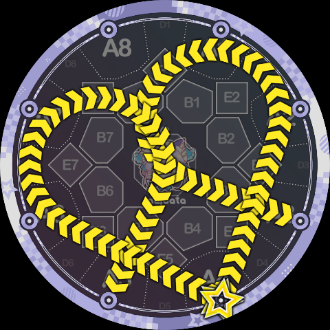
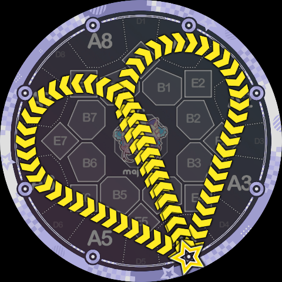

# Slide Code 概览

Slide Code 是一种由 Minepig 创造的新的 Slide 语法，一条复杂的 Slide 路径可以通过一串字符来表示，例如：`5Q9A1P98CQ49K5`。最早的 Slide Code 展示视频是 [相信彩虹，但是舞萌DX2077](https://www.bilibili.com/video/BV1Uu42eqEWF/)。MajdataViewX 自 6.1.0 版本开始已经支持 Slide Code 的编写。

## 阅读顺序

- [节点指令](./nodes)
- [轨道指令](./tracks)
- [省略规则与 Simai 兼容](./shorthand)
- [节点与轨道的连接](./node-paths)
- [轨道之间的连接](./track-transitions)
- [判定队列解析](./judgment)
- [外观设计建议](./appearance)
- [玩法设计建议](./playability)
- [配置样例](./examples)

## 设计理念

Slide Code 的设计理念基本上是：把官方的 Slide 形状切成一小段一小段的片段，然后在拼接成新的 Slide 路径。对 Maimai 比较熟悉且注意力集中的玩家们应该可以注意到，**官方的 Slide 基本上可以看作直线和圆弧的固定组合**，Slide Code 就是在使用这些线段、切线、圆弧作为组合用的片段来拼接。

Slide Code 的语法仅包含下面两种字符：

* **指令**：大写字母 `A, B, C, K, P, Q`
* **参数**：数字 `0~9`

一条 Slide Code 可以被看成是一连串的 `(指令, 参数)` 二元组的缩写，它们组成序列，依次描述了一段段的路径片段。根据指令的具体含义，我们可以将它们分成两组：节点指令 `A, B, C, K`（前往某个特定点）；轨道指令 `P, Q`（在特定圆周上旋转）。

## 效果展示

使用 Slide Code 你可以画出如下的这些传统语法写不出来的 Slide：

反向 ppqq-Slide：

更大的心形 Slide：

单手比心：

很像 `1v4` 但不是 `1v4` 的弧线 Slide：

很像 `1p5` 但不是 `1p5` 的折线 Slide：

更新但不一定更热的字母押：

阴阳鱼：

其他的一些不可名状的东西：

