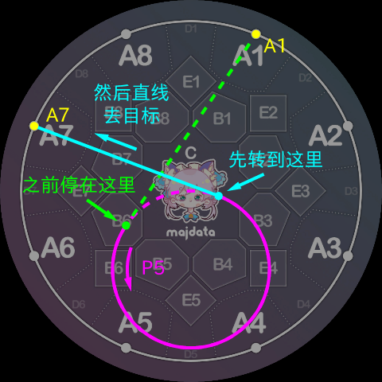
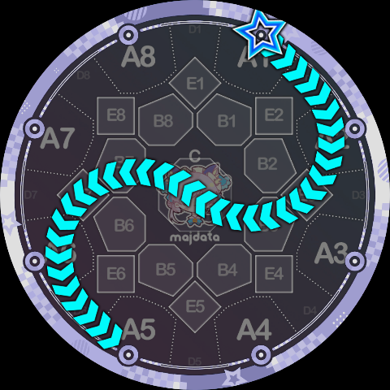

# 节点与轨道的连接

[节点指令](./nodes)和[轨道指令](./tracks)介绍了全部 6 种指令的定义，Slide Code 解析时，会首先展开成 `(指令, 参数)` 二元组的序列，每两个相邻的二元组就定义了一条 Slide 路径片段，所有的片段拼接起来就得到了完整的 Slide 路径。

理论上任何两个 `(指令, 参数)` 二元组之间可以任意地连接，不过考虑到具体语义，部分连接是不被允许的。本页介绍涉及节点的三种连接；轨道之间的连接见[轨道之间的连接](./track-transitions)。

## 节点 → 节点

这种连接是最好了解的，因为节点指令是“**直线前往指定点**”，因此当两个节点指令连接时，表示的路径片段就是一条连接两点的线段，任何两个节点指令都可以相连。先前介绍节点指令时已经见过不少例子了，在此不再赘述。

## 节点 → 轨道

节点指令后面连接轨道指令时，基本的语义就是“**沿着切线切入轨道，然后停在切点上准备开始绕行**”，具体的绕行角度仅由轨道指令还不足以判断，需要看轨道指令后面接了什么，所以会在之后的部分介绍。

众所周知，点和圆的关系有三种：点在圆外、点在圆上、点在圆内，因此当节点指令后面连接了轨道指令时，也会出现这三种情况。

节点在轨道内的情况，例如 `B2P3` 这样的序列，**这种连接是被禁止的**，因为没有一个合理的连接路径。

节点在轨道内的全部可能性有这些：

- 中央圆（编号 `0`）的内部有节点 C。
- 每个侧边圆（编号 `1~8`）的内部都有两个 B 区节点，例如轨道 3 内有 B2、B3。
- 所有的 B 区和 C 区节点都在最外圆（编号 `9`）内部，因此只有 A 区节点可以前往最外圆。

节点在轨道上的情况，例如 `CP3`、`A1Q9` 这样的序列，因为已经在轨道上所以就不需要走切线了，停留在原地准备开始绕行。全部的可能性有：

- 节点 C 在所有的侧边圆上。
- 所有 A 区节点都在最外圆上。

下面几种情况可能看起来有点像是“在轨道上”，但实际上是在轨道外，距离轨道圆周有一小段距离：

- 所有 B 区节点实际上都在中央圆外。
- 侧边圆经过的两个 A 区和两个 B 区，它们对应的节点实际上也在圆外。

节点在轨道外的情况，需要根据轨道指令的具体绕行方向，沿着对应方向的切线移动到切点的位置，如下图所示是 `A1P5` 的连接方式，非常好理解：

## 轨道 → 节点

在来到轨道上以后，具体绕行多远，需要看后面连接了什么指令，对于轨道指令后面连接节点指令时，基本语义是“**绕行到新的切点，然后沿切线离开，前往指定点**”。与先前 节点 → 轨道 类似，也可以分成三种情况，**节点在轨道内的情况依旧被禁止**，在轨道上的情况也只需要绕行不需要走切线。

例如，顺着上文 `A1P5` 的例子，假如整个片段是 `A1P5A7`，那么 `P5A7` 的部分会像下图一样解析：

解析器在计算绕行角度时，**会以尽可能短的路径绕行，任何情况下都不多绕一圈**，这也就是为什么在翻译官方的 `1pp4, 1pp5` 形状时需要显式指明多绕一圈。不过，对于绕行起点和终点恰好重合的情况（例如官方的 `8p5`），会绕完整的一圈 360°。总的来说在没有显式指明多绕圈时，**绕行角度永远在 `(0°, 360°]` 区间内**（[轨道之间的连接](./track-transitions)中有一个例外）。

使用以上三种连接方式已经足够分析很多的 Slide Code 了，例如上文的例子如果是完整的一条 Slide 就写作 `1P5K7`：

再比如[概览](./index)中展示的反向 ppqq-Slide，只需要将正向 ppqq 翻译成 Slide Code 以后，倒着写一遍。例如下图就是 `5pp4/3qq4` 的反向，只需先翻译成 `5P7K4/3Q2K4`，然后逐一反转为 `4Q7K5/4P2K3`。当然，由于变成了同头 Slide，还需要按照同头 Slide 的语法最终改为 `4Q7K5 *P2K3`：

再比如下图是 `4Q2K4 *P7K4`：

下图是 `4P2B8P7K4`，利用 B8 区作为两个侧边圆的中转点：

下图是 `1Q2CP6K5`，利用 C 区作为中转点，由于两圆刚好在屏幕中心相切，看起来衔接非常顺滑：

