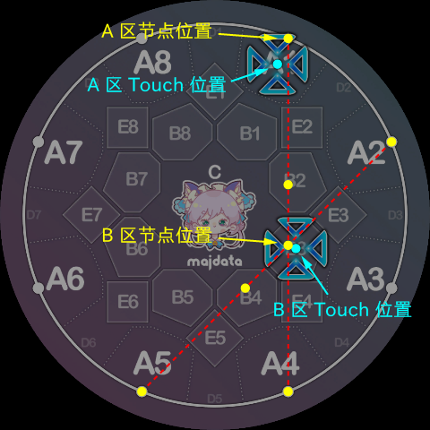
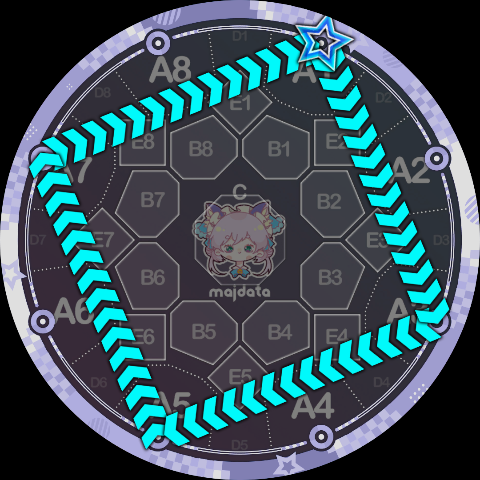
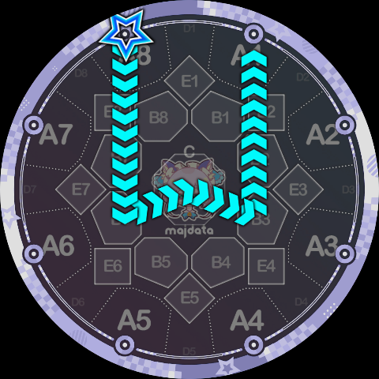

# 节点指令

这类指令要求 Slide **走直线前往指定的判定区位**置，因此这类指令连带上后面的参数，其实就是目标判定区的名字，即 `A1, B3, C, B8` 这种。

熟悉 Maimai 的玩家们应该知道，官方的 Slide 判定是只看 A、B、C 区，不考虑 D、E 区的，因此，为了能够给 Slide Code 定义的 Slide 能够写出合理的判定队列，**Slide Code 中只包含了 A、B、C 区对应的指令**：

* **A 指令**：直线前往 A 区。参数为 `1~8`，表示具体 A 区的键位号。
  * 注意：目标点不在 Touch 的位置，而是位于**判定线上**，允许前往相邻位置。
* **B 指令**：直线前往 B 区。参数为 `1~8`，表示具体 B 区的键位号。
  * 注意：目标点不在 Touch 的位置，而是稍微偏向屏幕中心的位置（考虑 `1-4` 和 `2-5` 的交点，它并不在 `B3` 这个 Touch 的位置上）。
* **C 指令**：直线前往 C 区（屏幕正中心）。**此指令后不可跟随任何参数。**

具体而言，这 17 个节点的位置如下图：

请注意它们与相应判定区的 Touch 位置的差异：

之所以引入以上的位置差异，是为了最大化的沿用官方 Slide 形状，这一定程度上可以让组合出来的 Slide 看起来更美观。

特别的，**由于官方 Slide 永远只会结束在 A 区**，Slide Code（目前）也保留了这一个性质，我们使用一个特殊的指令标识 Slide 的结束：

- **K 指令**：表示 Slide 的终点。其视觉表现与 A 指令完全相同，但它标志着整条 Slide 结算结束。**Slide Code 必须以 K 指令及其参数结尾。** 参数为 `1~8`，表示具体 A 区的键位号。

> K 指令之所以采用 K 这个字母，实际上是一个双关。一个直白的解释是“按键”（Key），由于外键在屏幕外面，Slide 前往某个外键相当于“离开了内屏”，因此就是结束了。
> 此外，众所可能不周知，Minepig 是乐理深度爱好者，因此 K 的第二个解释是字面意思的“终止”（Cadence，德文 Kadenz），neta 自乐理中的终止四六和弦 $\mathrm{K}^6_4$。

技术上，我们有时会把 Slide 的起点也单独算作一种节点指令，但这个指令不会真的出现在 Slide Code 字符串中：

- **X 指令**：表示 Slide 的起点，**但在 Slide Code 中必须省略字母 `X`，直接像传统 Slide 语法 `1-4` 一样单独写数字即可。** 参数为 `1~8`，对应判定线上的八个起始点，也即 A 指令的节点位置。

有了以上四个指令我们已经可以写出下面这些简单的折线 Slide 了：

`1B7K5`，即 1 号键出发，在 B7 转折，到 5 号键结束，看起来很像 `1p5`。

`1A3A5A7K1` 基本上就是 `1-3-5-7-1` 的 Slide Code 写法。

`8B7A6B5A4B3A2B1K8` 是一颗四芒星。

`8B6CB3K1`，看起来像一个小型的 W。

