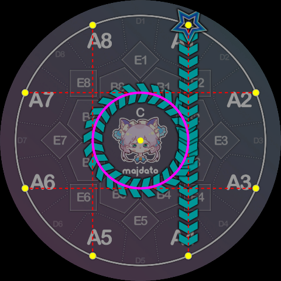
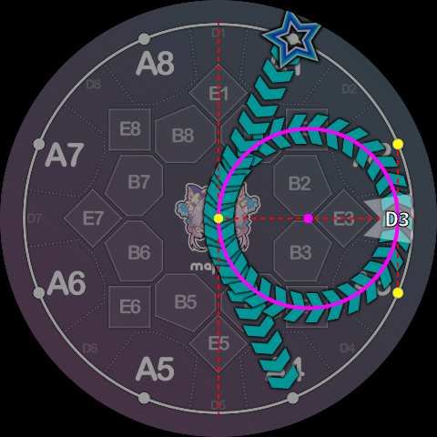
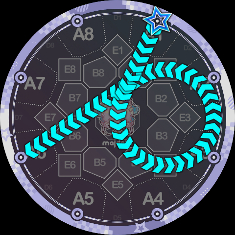
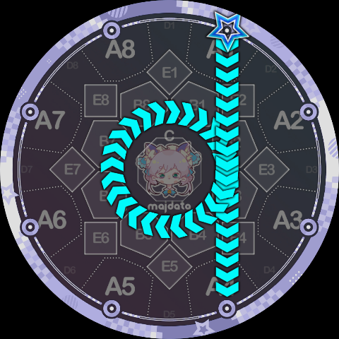
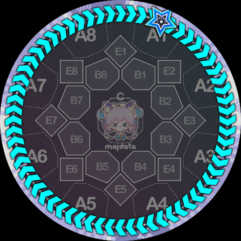
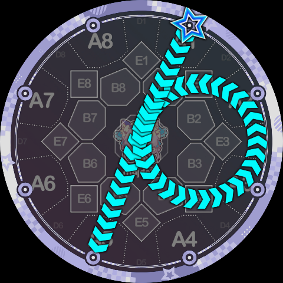
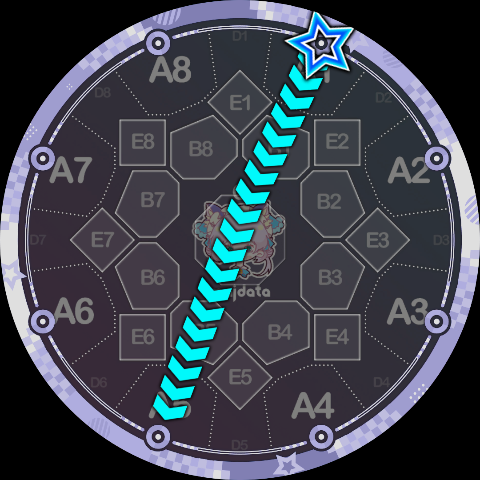
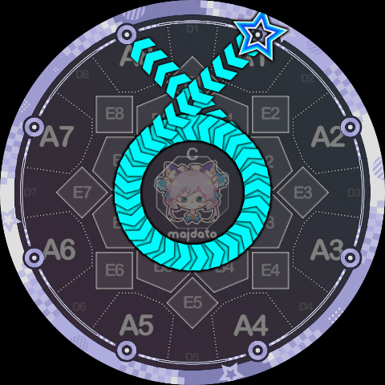

# 轨道指令

这类指令要求 Slide **绕着特定的圆形轨道旋转**，如果路径起点在该圆形外部，会先沿着切线切入圆周再旋转，离开轨道去往外部时，也会先旋转到合适角度再沿着切线离开。

在官方的 Slide 形状中，共有 10 个不同的圆，在 Slide Code 中它们各自被赋予了一个 `0~9` 的编号：

* 侧边圆：标准语法中 ppqq-Slide 绕行的圆，总共有 8 个。方便起见，侧边圆的编号与它经过的 D 区键位号一致，取值范围是 `1~8`。（例如标准语法的 `1pp4` 绕行的圆经过了 D3，就是 3 号圆）
* 中央圆：即标准语法中 pq-Slide 绕行的圆，它不经过任何的 D 区，所以被赋予了编号 `0`。
* 最外圆：即标准语法中 `<`, `>` Slide 绕行的圆，也即判定线本身，它经过了所有的 D 区，所以被赋予了最大的编号 `9` （也只剩这一个编号了）。

如图所示是中央圆的具体定义：

这是侧边圆的定义（图中为 3 号圆）：

最外圆就是判定线本身，不再赘述。

旋转可以是顺时针或者逆时针，Slide Code 化用了标准 simai 的 `p, q` 记法，构造了如下两个轨道指令：

* **P 指令**：绕指定圆**逆时针**旋转。参数为 `0~9`，表示具体圆的编号。
* **Q 指令**：绕指定圆**顺时针**旋转。参数为 `0~9`，表示具体圆的编号。

利用这两个轨道指令，我们可以把官方的 Slide 形状转译成 Slide Code：

`1pp6 = 1P3K6`，即 1 号键出发，绕 3 号圆逆时针旋转，然后到 6 号键结束。

`1q4 = 1Q0K4`，这里是恰好转了 360°。

`1>1 = 1Q9K1`，同样是恰好转了 360°。

注意，官方的 `1pp4` 和 `1pp5` 比较特殊，因为它们绕行的圆心角超过了 360°，这种情况下，Slide Code 需要将轨道指令重复一遍，来表示”多绕一圈“：

`1pp4 = 1P3P3K4`，重复的 `P3` 表示要多绕 3 号圆一圈。

`1pp5 = 1P3P3K5`，如果回看一下侧边圆的形状定义，应该可以理解为什么这里超过了 360°，而不是恰好 360°。

当然，这意味着你可以故意不多绕一圈，比如：

很像 `1-5` 但不是 `1-5` 的 `1P3K5`（注意轨迹稍微向左弯曲了一点）。

很像 `1v4` 但不是 `1v4` 的 `1P3K4`。

既然可以要求多绕一圈，那当然也可以多绕很多很多圈，比如 `1P0P0P0P0P0K8` 总共绕了 4.75 圈：

